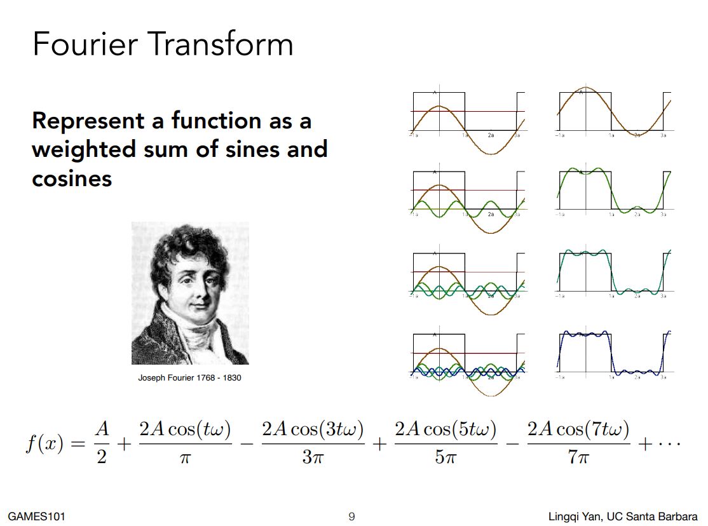

# Environment Lighting

环境光贴图(Environgment Lighting Map)是一张表示所有方向的远距离光照的贴图。

- Spherical map
- cube map

基于环境光的shading，正式名叫做基于图像的光照(Image-Based Lighting, IBL).
如何把环境光贴图用于shading。
解渲染方程
$L_o(p, w_o)=\int_{\Omega^+}L_i(p,w_i)f_r(p,w_i,w_o)cos{\theta}_iV(p,w_i)dw_i$
一般使用Monte Carlo积分的方法来解上面的渲染方程。蒙特卡洛积分方法是一个数值解法，要求大量采样。带来的问题就是会很慢。

回忆一个前面几节课讲的近似等式。

$\int_{\Omega}f(x)g(x)dx\approx\frac{\int_{\Omega_G}f(x)dx}{\int_{\Omega_G}dx}\cdot\int_{\Omega}g(x)dx$
如果积分域$\Omega$很小的话，就能得到一个误差可接受的结果。

BRDF满足任何条件下的准确条件。我们可以把光照那项移出去，得到

$L_o(p,w_o)\approx\frac{\int_{\Omega_{f_r}}L_i(p,w_i)dw_i}{\int_{\Omega_{f_r}}dw_i}\cdot\int_{\Omega^+}L_i(p,w_i)f_r(p,w_i,w_o)cos{\theta}_idw_i$

## 分裂求和第一步

预先生成一系列不同的环境光照滤波结果。
然后查询位于（镜面反射）r方向的预先滤波的环境光结果。

## 分裂求和第二步

$L_o(p,w_o)\approx\frac{\int_{\Omega_{f_r}}L_i(p,w_i)dw_i}{\int_{\Omega_{f_r}}dw_i}\cdot[\int_{\Omega^+}L_i(p,w_i)f_r(p,w_i,w_o)cos{\theta}_idw_i]$
注意到方括号括起来的那一项仍然是一个积分，能不能避免采样这一项。

idea
预先计算所有可能组合的值，包括粗糙程度(roughness)，颜色等等。但是仍然需要一张非常大的表格来存储信息。

$\bm{f(i,o)=\frac{F(i,h)G(i,o,h)D(h)}{4(n,i)(n,o)}}$
其中$F(i,h)$表示Fresnel项，$G(i,o,h)$表示阴影遮挡项,$D(h)$表示法线分布项。

Fresnel term: the Schlick's approximation
$R(\theta)=R_0+(1-R_0)(1-cos\theta)^5$
$R_0=(\frac{n_1-n_2}{n_1+n_2})^2$

NDF term: e.g. Beckmann distribution
$D(h)=\frac{e^{-\frac{tan^2\theta_h}{\alpha^2}}}{\pi\alpha^2cos^4\theta_{h}}$

尝试把$F$分解下
$1=\frac{F}{F}=\frac{R_0+(1-R_0)(1-cos\theta)^5}{F}=\frac{R_0(1-(1-cos\theta)^5)+(1-cos\theta)^5}{F}$

$\int_{\Omega^+}f_r(p,w_i,w_o)cos\theta_idw_i \approx R_0\int_{\Omega^+}\frac{f_r}{F}(1-(1-cos\theta^5))cos\theta_idwi+\int_{\Omega^+}\frac{f_r}{F}(1-cos\theta)^5cos\theta_idw_i$

## Precomputed Radiance Transfer

### 环境光照中的阴影

不同的视角：
- 把它作为一个多光源问题：那么shadow map的代价与光源的数量成正比。
- 把它作为一个采样问题：
  - 可见项V可以任意复杂
  - 并且V很难从环境中分离出去

工业界的解决方案是：只生成场景中最亮的光源的阴影。

相关的研究
- Imperfect shadow maps
- Light cuts
- RTRT（might be the ultimate solution）
- Precomputed radiance transfer

### 傅里叶变换

一个周期函数可以通过傅里叶变化分解为如下形式：
$f(x)=\frac{a_0}{2}+\sum_{n=1}^{\infin}a_ncosnx+b_nsinnx$

对于上图的方波函数，它的周期为4a，如何计算它的各项系数呢？
$w=\frac{2\pi}{T}$
$w=\frac{2\pi}{4a}=\frac{\pi}{2a}$

$f(x)=\frac{a_0}{2}+\sum_{n=1}^{\infin}a_ncosnwx+b_nsinnwx$
为了求$a_n$,将方程两边同时乘以$cosnwx$
$\int_{-a}^{3a} f(x)dx=\int_{-a}^{3a}a_ncosnwx\cdot cosnwxdx$
等式左边求积分
$\int_{-a}^{3a} f(x)dx=\int_{-a}^{a}Acosnwxdx=\frac{A}{nw}sinnwx|_{-a}^{a}$
等式右边求积分
$\int_{-a}^{3a}a_ncosnwx\cdot cosnwxdx=\int_{-a}^{3a}a_n\frac{1+cos2nwx}{2}dx=2aa_n$

所以求得$an=\frac{2A}{\pi},0,-\frac{2A}{3\pi},0,\frac{2A}{5\pi}...$
求$b_n$得方法也如出一辙，都是用到了基函数的正交性质:

$\int_{-\pi}^{\pi}cosnx\cdot coskxdx=0$
$\int_{-\pi}^{\pi}cosnx\cdot sinkxdx=0$
$\int_{-\pi}^{\pi}sinnx\cdot sinkxdx=0$

参考了[知乎](https://zhuanlan.zhihu.com/p/104079068)上这篇文章

#### 基函数

用来表示其他函数一系列函数
$f(x)=\sum_{i}c_i\cdot B_i(x)$
前面所说的傅里叶变换也是将原函数分解为一系列正交的基函数上。
多项式函数也可以作为基函数，泰勒展开就是将原函数用一系列多项式函数去逼近。

### Spherical Harmonics

球面谐波函数是一系列定义在球面坐标下的二维基函数
